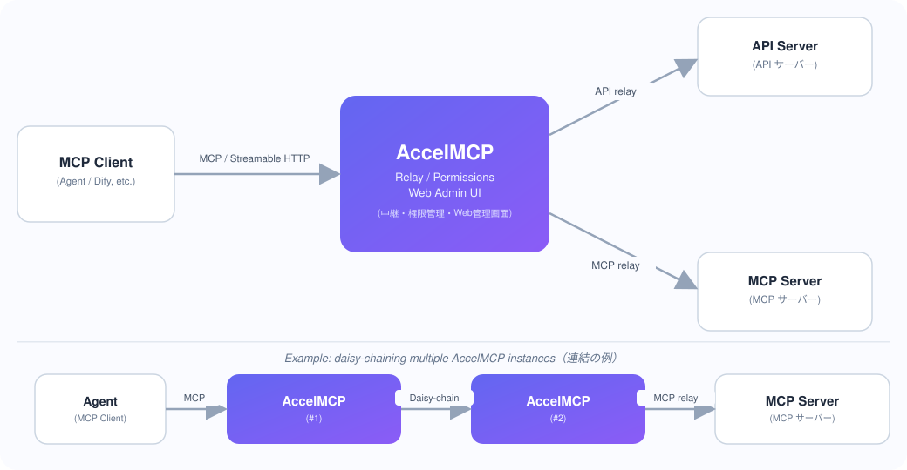

# MCP Server with Flask and FastMCP

English | [日本語](README.md)

HTTP/stdio compatible MCP server with API/MCP relay functionality and user-based permission management via a Web admin interface.



## Features

- **MCP Protocol Support**: Compatible with both HTTP and stdio
- **Relay Functionality**: Relay to API and MCP servers
- **Permission Management**: User-specific Tool usage permission control
- **Web Admin Interface**: Manage Services, Capabilities, and Accounts
- **Bearer Token Authentication**: Per-account token generation

## Container Layout

AccelMCP is composed of the following containers (`web` and `mcp` share the same image):

- `caddy`: Reverse proxy / TLS (routes by path to `web` and `mcp`)
- `web`: Admin UI + REST API (runs DB migrations on startup)
- `mcp`: MCP endpoint (can be scaled to multiple replicas / separate hosts)
- `redis`: Shared store for Streamable HTTP sessions
- `db`: PostgreSQL

Both single-host (all-in-one) and multi-host (WEB/MCP/Redis split across servers) run from the
**same compose definition**. MCP sessions are shared via Redis when `REDIS_URL` is set, and fall
back to in-process memory when it is unset. See [Scaling & Containers](docs/en/SCALING.en.md) for details.

## Starting the Server

```bash
# Start with Docker Compose
docker-compose up -d

# View logs
docker-compose logs -f

# Stop
docker-compose down
```

## Access

- Web Admin Interface: http://admin.lvh.me:5000/ or http://localhost:5000/
- Default Administrator
  - ID: `accel`
  - Password: `universe`

**⚠️ Security Warning**

- **MUST change credentials in production environments**
- Can be overridden with environment variables `ADMIN_USERNAME` and `ADMIN_PASSWORD`
- Default credentials are for demo/testing purposes (like Oracle's scott/tiger)

**Override credentials via environment variables:**

```bash
# docker-compose.yml or .env
environment:
  ADMIN_USERNAME: your_secure_username
  ADMIN_PASSWORD: your_secure_password
```

**Note**: The `admin` subdomain is dedicated to the admin interface and is handled separately from service subdomains.

## Security Features

### Brute-Force Attack Protection

Admin login includes IP-based rate limiting:

- **Default Settings**: 5 failed attempts lock for 30 minutes
- **Logging**: All login attempts (success/failure) are recorded
- **Manual Unlock**: Unlock IP addresses from admin interface

### Audit Logging

All admin operations are automatically logged:

- **Login History**: Username, IP address, success/failure, timestamp
- **CRUD Operation History**: Create, update, delete operations for MCP Services, Apps, Capabilities, Accounts, Permissions
- **Change Tracking**: Before/after values stored in JSON format
- **CSV Export**: Export audit reports as CSV

**Audit Log APIs:**

- `GET /api/admin/login-logs` - Retrieve login history
- `GET /api/admin/login-logs/export` - Export login history as CSV
- `GET /api/admin/action-logs` - Retrieve operation history
- `GET /api/admin/action-logs/export` - Export operation history as CSV
- `POST /api/admin/unlock-account` - Unlock IP address
- `GET /api/admin/locked-ips` - List locked IP addresses

### Security Settings

Customizable via AdminSettings:

- `login_max_attempts`: Login attempt limit (default: 5)
- `login_lock_duration_minutes`: Lock duration (default: 30 minutes)
- `audit_log_retention_days`: Audit log retention period (default: 365 days)

## Admin Interface Structure

### Login Screen

- Administrator authentication

### Service Management

- Service list display
- Create new service (subdomain, common headers)
- Service details/edit
- Capability management

### Capability Management

- Capability list
- Register capability (API/MCP selection, URL, headers, body configuration)
- Edit/delete capability

### Account Management

- Account list
- Register account (login ID, password)
- Account details (Bearer token display)
- Edit/delete account information

## MCP Client Connection

### Subdomain-Based Access (Recommended)

#### 1. Get Capabilities (GET Request)

```bash
# Using lvh.me domain (for local development)
curl -H "Authorization: Bearer YOUR_TOKEN" \
  http://myservice.lvh.me:5000/mcp

# Or using subdomain parameter
curl -H "Authorization: Bearer YOUR_TOKEN" \
  http://localhost:5000/mcp?subdomain=myservice
```

**Response Example:**

```json
{
  "capabilities": {
    "tools": [
      {
        "name": "get_weather",
        "description": "Get current weather information",
        "inputSchema": {
          "type": "object",
          "properties": {
            "city": {
              "type": "string",
              "description": "Parameter: city"
            }
          }
        }
      }
    ]
  },
  "serverInfo": {
    "name": "Weather Service",
    "version": "1.0.0"
  }
}
```

#### 2. Execute Tool (POST Request)

```bash
# Execute tool directly
curl -X POST \
  -H "Authorization: Bearer YOUR_TOKEN" \
  -H "Content-Type: application/json" \
  -d '{"arguments": {"city": "Tokyo"}}' \
  http://myservice.lvh.me:5000/tools/get_weather

# Or execute via MCP protocol
curl -X POST \
  -H "Authorization: Bearer YOUR_TOKEN" \
  -H "Content-Type: application/json" \
  -d '{
    "jsonrpc": "2.0",
    "id": 1,
    "method": "tools/call",
    "params": {
      "name": "get_weather",
      "arguments": {"city": "Tokyo"}
    }
  }' \
  http://myservice.lvh.me:5000/mcp
```

### MCP Client Configuration

#### HTTP Connection (Dify, Claude Desktop, etc.)

```json
{
  "mcpServers": {
    "my-service": {
      "url": "http://myservice.lvh.me:5000/mcp",
      "transport": {
        "type": "http"
      },
      "headers": {
        "Authorization": "Bearer YOUR_TOKEN"
      }
    }
  }
}
```

#### Legacy Endpoint (Backward Compatibility)

```json
{
  "mcpServers": {
    "my-service": {
      "url": "http://localhost:5000/mcp/myservice",
      "headers": {
        "Authorization": "Bearer YOUR_TOKEN"
      }
    }
  }
}
```

### stdio Connection

```json
{
  "mcpServers": {
    "my-service": {
      "command": "docker",
      "args": [
        "exec",
        "-i",
        "mcp_server",
        "python",
        "stdio_server.py",
        "myservice",
        "YOUR_TOKEN"
      ]
    }
  }
}
```

## Endpoint List

### MCP Endpoints

| Endpoint                                  | Method | Description                                   |
| ----------------------------------------- | ------ | --------------------------------------------- |
| `<subdomain>.lvh.me:5000/mcp`             | GET    | Get Capabilities available to the account     |
| `<subdomain>.lvh.me:5000/mcp`             | POST   | Process MCP requests (tools/list, tools/call) |
| `<subdomain>.lvh.me:5000/tools/<tool_id>` | POST   | Execute a specific Tool directly              |
| `/mcp/<subdomain>`                        | POST   | Legacy endpoint (backward compatibility)      |

**Note:** `lvh.me` is a domain for local development that always resolves to 127.0.0.1. Use your own domain in production.

## Database Structure

- **users**: User information, authentication data
- **services**: Registered services (subdomain, common headers)
- **capabilities**: Tool definitions (API/MCP, URL, headers, body)
- **user_permissions**: User × Capability permission mapping
- **mcp_connection_logs**: MCP connection logs (audit trail)

## Connection Logs

### Structured JSON Logs to stdout

AccelMCP outputs all MCP connection logs as structured JSON to stdout. This enables automatic log aggregation by any container log collection system.

**Supported Platforms:**

- **AWS ECS/Fargate** → CloudWatch Logs
- **Google Cloud Run** → Cloud Logging
- **Azure Container Apps** → Azure Monitor
- **Kubernetes** → kubelet → Fluentd/Fluent Bit → any backend
- **Heroku** → Logplex
- Any platform that supports Docker containers

**Log Format Example:**

```json
{
  "timestamp": "2026-01-08T12:34:56.789Z",
  "log_type": "mcp_connection",
  "level": "INFO",
  "mcp_method": "tools/call",
  "mcp_service_id": 7,
  "mcp_service_name": "OpenAI Service",
  "app_id": 43,
  "app_name": "ChatGPT API",
  "capability_id": 215,
  "capability_name": "generate_text",
  "tool_name": "generate_text",
  "account_id": null,
  "account_name": null,
  "status_code": 200,
  "is_success": true,
  "duration_ms": 1234,
  "ip_address": "192.168.1.1",
  "user_agent": "Claude/1.0",
  "access_control": "public",
  "request_id": "abc123",
  "error_code": null,
  "error_message": null,
  "request_body": "{\"prompt\":\"Hello\"}",
  "response_body": "{\"text\":\"Hi there!\"}"
}
```

### Environment Variables

```bash
# Enable/disable stdout logging (default: true)
MCP_LOG_STDOUT=true
```

### Disable Logging

To disable log output in development:

```bash
MCP_LOG_STDOUT=false docker compose up
```

### Cloud Platform Integration

**AWS ECS/Fargate:**

```json
{
  "logConfiguration": {
    "logDriver": "awslogs",
    "options": {
      "awslogs-group": "/ecs/accel-mcp",
      "awslogs-region": "ap-northeast-1",
      "awslogs-stream-prefix": "mcp"
    }
  }
}
```

Query with CloudWatch Insights:

```
fields @timestamp, mcp_method, tool_name, duration_ms, is_success
| filter log_type = "mcp_connection"
| filter is_success = false
| sort @timestamp desc
```

**Google Cloud Run:**

Automatically sent to Cloud Logging with `jsonPayload` filtering:

```
jsonPayload.log_type="mcp_connection"
jsonPayload.is_success=false
```

**Kubernetes (Fluent Bit):**

```yaml
[FILTER]
    Name parser
    Match *
    Key_Name log
    Parser json

[FILTER]
    Name modify
    Match *
    Condition Key_value_matches log_type mcp_connection
    Add k8s_label_app accel-mcp
```

## Development

```bash
# Develop locally
python -m venv venv
source venv/bin/activate  # Windows: venv\Scripts\activate
pip install -r requirements.txt
python app.py
```

### Code Quality Checks

This project uses **Ruff** (linter & formatter) and **mypy** (type checker) for code quality.

**Run all checks:**

```bash
./run_check.sh
```

This script runs:

- Code style checks with Ruff
- Format checks with Ruff
- Type checks with mypy

**Auto-fix and format:**

```bash
./run_format.sh
```

This script runs:

- Auto-fix with Ruff
- Code formatting with Ruff

**Run individually:**

```bash
# Ruff linter
ruff check app/ tests/

# Ruff formatter (check only)
ruff format app/ tests/ --check

# Ruff formatter (apply)
ruff format app/ tests/

# mypy type checker
mypy app/

# Auto-fix
ruff check app/ tests/ --fix
```

**Configuration:**

- `pyproject.toml` - Ruff and mypy configuration

> **Note:** `check.sh` and `format.sh` have been renamed to `run_check.sh` and `run_format.sh`.

## Documentation

Detailed documentation is available in the `docs/` directory.

| Document                                                                       | Description                                                |
| ------------------------------------------------------------------------------ | ---------------------------------------------------------- |
| [Quick Start](docs/en/QUICKSTART.en.md) / [日本語](docs/QUICKSTART.md)         | Fastest way to start and test the MCP server in 5 minutes  |
| [Setup Guide](docs/en/SETUP.en.md) / [日本語](docs/SETUP.md)                   | Detailed setup and startup instructions                    |
| [MCP Endpoints](docs/en/MCP_ENDPOINTS.en.md) / [日本語](docs/MCP_ENDPOINTS.md) | Detailed usage of each MCP server endpoint                 |
| [Directory Structure](docs/en/STRUCTURE.en.md) / [日本語](docs/STRUCTURE.md)   | Project structure based on MVC pattern                     |
| [Testing Guide](docs/en/TESTING.en.md) / [日本語](docs/TESTING.md)             | How to run and configure unit and integration tests        |
| [E2E Testing](docs/en/E2E_TESTING.en.md) / [日本語](docs/E2E_TESTING.md)       | How to run E2E tests with Playwright                       |
| [Database Migration](docs/en/MIGRATION.en.md) / [日本語](docs/MIGRATION.md)    | Database migration management with Flask-Migrate (Alembic) |
| [Scaling & Containers](docs/en/SCALING.en.md) / [日本語](docs/SCALING.md)      | Container layout, single-host vs. multi-host, Redis-backed sessions, scaling the MCP endpoint |

## About This Project

This project was built **100% through vibe coding** — all code was implemented via pair
programming with AI.

**Models used:**

- Claude Sonnet 4.5 / 4.6
- Claude Opus 4.8
