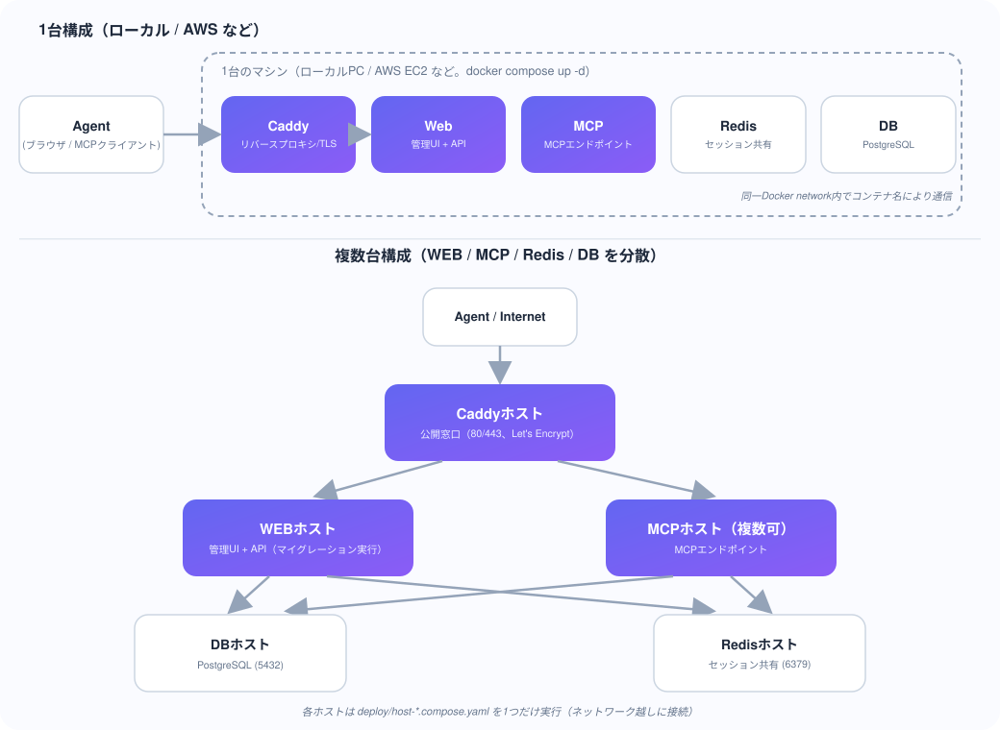

[English](en/SCALING.en.md) | 日本語

# スケーリングとコンテナ構成

AccelMCP は **同一イメージのまま**、1台運用にも複数台運用にも対応します。
役割(WEB管理画面 / MCPエンドポイント)を別コンテナに分け、Streamable HTTP の
セッションを Redis で共有することで、MCP エンドポイントだけを水平スケールできます。

## コンテナ構成

| サービス | 役割 | 備考 |
| --- | --- | --- |
| `caddy` | リバースプロキシ / TLS | パスで `web` と `mcp` に振り分け |
| `web` | 管理UI + REST API | 起動時に DB マイグレーションを実行 |
| `mcp` | MCP エンドポイント | `web` と同一イメージ。マイグレーションは実行しない |
| `redis` | セッション共有ストア | Streamable HTTP セッションを保持 |
| `db` | PostgreSQL | アプリのデータ |

`web` と `mcp` は **同じイメージ・同じアプリ**(全Blueprint登録)で、Caddy が
リクエストのパスで振り分けます。これにより「全部入り1台」も「役割分担の複数台」も
同じ compose 定義で動きます。

### Caddy のルーティング

ホスト名に関わらず、**パス**で `web`/`mcp` に振り分けます。

| パス | 振り分け先 |
| --- | --- |
| `/mcp`, `/mcp/<subdomain>`, `/<identifier>/mcp`, `/admin/mcp`, `/tools/*` | `mcp` |
| 上記以外(`/`, `/dashboard`, `/api/*`, `/assets/*` など) | `web` |

Caddy は `localhost`(または `ACCEL_MCP_DOMAIN`)と、ローカル開発用の `lvh.me` / `*.lvh.me`
の両方を受け付けます。`lvh.me` は常に `127.0.0.1` を指す公開DNSなので、サブドメイン方式の
MCPサービス(`<identifier>.lvh.me/mcp`)を追加設定なしでテストできます。

## 1. 1台運用(ローカル・AWS 等)



Dify と同様に、1つのマシンで全コンテナを起動します。**ローカルPCでも、AWS EC2のような
クラウドVMでも、手順は同じです**(違いは「実ドメインを使うか」だけ)。

### ローカル開発・検証

```bash
git clone https://github.com/t-ogawa-dev/AccelMCP.git
cd AccelMCP
cp .env.example .env
docker compose up -d
```

`https://localhost/` でアクセスします(自己署名証明書の警告は許容して進む。
[HTTPS](#https) 節を参照)。`ACCEL_MCP_DOMAIN`は設定不要です。

### 本番運用(実ドメインで1台に集約。AWS EC2 / 自前サーバ等)

1. マシンを用意し、Docker と Docker Compose をインストールする
   (AWSの場合: EC2インスタンスを起動し、セキュリティグループで **80・443番を
   `0.0.0.0/0` に許可**、SSH用に22番を許可)
2. 取得したドメインのDNS Aレコードを、そのマシンのパブリックIPに向ける
3. リポジトリを配置し `.env` を作成・編集:

   ```bash
   git clone https://github.com/t-ogawa-dev/AccelMCP.git
   cd AccelMCP
   cp .env.example .env
   ```

   `.env` で以下を変更:

   ```bash
   ACCEL_MCP_DOMAIN=mcp.example.com   # 取得したドメイン
   FLASK_ENV=production
   SECRET_KEY=<openssl rand -hex 32 などで生成したランダム文字列>
   ADMIN_USERNAME=<デフォルトから変更>
   ADMIN_PASSWORD=<デフォルトから変更>
   ```

4. 本番用 Caddyfile (Let's Encrypt) を指定して起動:

   ```bash
   CADDYFILE=./Caddyfile.prod docker compose up -d --build
   ```

   (`.env` に `CADDYFILE=./Caddyfile.prod` を書いておけば、以降は単に
   `docker compose up -d` でも反映されます)

5. `https://mcp.example.com/login` にアクセスして確認(Let's Encrypt証明書が
   自動取得されるので、ブラウザの警告は出ません)

- `web` / `mcp` / `redis` / `db` / `caddy` が同一マシンで動きます。
- Redis があるので Streamable HTTP セッションは Redis に保存されますが、
  1台なら in-memory でも動作します(後述)。
- 複数マシンに分けたい場合は [4. 複数ホストに分散する](#4-複数ホストに分散する) へ。

## HTTPS

`web`/`mcp` コンテナのポート 5000 は**ホストには公開されません**(`expose` のみ)。
ブラウザ・MCPクライアントからは必ず Caddy 経由でアクセスします。

| 用途 | URL |
| --- | --- |
| Web管理画面 | `https://localhost/` |
| MCPサービス(サブドメイン方式) | `https://<identifier>.lvh.me/mcp` |
| MCPサービス(パス方式) | `https://localhost/<identifier>/mcp` |

ポート番号は不要です(Caddyが443番で受けて内部の5000番へ中継します)。

### 証明書が「信頼されていません」と表示される

これは正常です。ローカル開発用の `Caddyfile` は `tls internal` で **Caddy自身の自己署名CA**
から証明書を発行しています(Let's Encryptはローカル開発では使えません。`localhost`や`lvh.me`
は実在の公開ドメインではないため)。対処方法は2つあります。

**A. ブラウザの警告を無視して進む(最も簡単)**

警告画面で「詳細」→「アクセスする(安全ではありません)」を選べば表示されます。

**B. CaddyのローカルCAをOSに信頼させる(警告を消したい場合)**

```bash
docker cp mcp_caddy:/data/caddy/pki/authorities/local/root.crt ./caddy_local_ca.crt
```

取り出した `caddy_local_ca.crt` を、macOSなら「キーチェーンアクセス」にドラッグして
「常に信頼」に設定、Windowsなら「信頼されたルート証明機関」にインポートします。

### Docker を使わず `python run.py` で直接起動する場合

Flask開発サーバーがポート5000で直接起動するので、TLSなしでアクセスします
(`http://localhost:5000/`、`http://<identifier>.lvh.me:5000/mcp`)。

## 2. セッションストア(Redis)について

Streamable HTTP は `initialize` で発行した `Mcp-Session-Id` を後続リクエストで
検証します。MCP エンドポイントを**複数レプリカ/複数ホスト**にすると、後続リクエストが
別レプリカに振られた際にセッションを認識できなくなるため、セッションを共有ストアに
置く必要があります。

- 環境変数 `REDIS_URL` が **設定されている**場合: Redis にセッションを保存(共有)。
  - 例: `REDIS_URL=redis://redis:6379/0`
  - `mcp` を複数レプリカ化しても、どのレプリカでもセッションを検証できます。
- 環境変数 `REDIS_URL` が **未設定**の場合: プロセス内メモリに保存。
  - 追加インフラ不要。**1台・単一プロセス運用**ならこれで十分です。
  - 複数レプリカにするとセッションがレプリカ間で共有されないので不可。

`compose.yaml` ではデフォルトで `REDIS_URL=redis://redis:6379/0` を渡しています。
Redis を使いたくない単一構成にする場合は `REDIS_URL` を空にしてください。

## 3. MCP エンドポイントだけスケールする

同一ホストでレプリカを増やす場合:

```bash
docker compose up -d --scale mcp=3
```

(Caddy の `reverse_proxy mcp:5000` は Docker DNS のラウンドロビンで複数レプリカに
分散します。`REDIS_URL` でセッションが共有されているため、どのレプリカが後続
リクエストを受けても整合します。)

## 4. 複数ホストに分散する

WEB / MCP / Redis / DB を別々のマシンで動かす構成です。`deploy/` ディレクトリに
**ホストの役割ごとに分割した compose ファイル**を用意しているので、各マシンで該当する
ファイルだけを起動します。

| ファイル | 役割 | 起動するマシン |
| --- | --- | --- |
| `deploy/host-db.compose.yaml` | PostgreSQL | DBホスト |
| `deploy/host-redis.compose.yaml` | Redis (セッション共有) | Redisホスト |
| `deploy/host-web.compose.yaml` | 管理UI + REST API(マイグレーション実行) | WEBホスト |
| `deploy/host-mcp.compose.yaml` | MCPエンドポイント | MCPホスト(複数可) |
| `deploy/host-caddy.compose.yaml` | リバースプロキシ / TLS(公開窓口) | Caddyホスト |

### ネットワーク要件(ファイアウォール/セキュリティグループ)

| ホスト | 開けるポート | 許可元 |
| --- | --- | --- |
| DBホスト | 5432 | WEBホスト・MCPホストのIPのみ |
| Redisホスト | 6379 | WEBホスト・MCPホストのIPのみ |
| WEBホスト | 5000 | CaddyホストのIPのみ |
| MCPホスト | 5000 | Caddyホストのみ |
| Caddyホスト | 80・443 | インターネット全体(公開窓口) |

### 手順

各マシンに Docker / Docker Compose をインストールし、リポジトリを配置してから
以下を実行します(`deploy/` ディレクトリで実行)。

**1. DBホストで:**

```bash
cd deploy
docker compose -f host-db.compose.yaml up -d
```

**2. Redisホストで:**

```bash
cd deploy
docker compose -f host-redis.compose.yaml up -d
```

**3. WEBホストと MCPホスト(全台)に共通の `.env` を配置:**

```bash
# .env (リポジトリルート)
DATABASE_URL=postgresql://mcpuser:mcppassword@<DBホストのアドレス>:5432/mcpdb
REDIS_URL=redis://<Redisホストのアドレス>:6379/0
SECRET_KEY=<ランダムな文字列>
ADMIN_USERNAME=<デフォルトから変更>
ADMIN_PASSWORD=<デフォルトから変更>
FLASK_ENV=production
```

**4. WEBホストで(マイグレーションが実行されます):**

```bash
cd deploy
docker compose -f host-web.compose.yaml up -d --build
```

**5. MCPホストで(MCPホストを増やす場合は同じ手順を他のマシンでも繰り返す):**

```bash
cd deploy
docker compose -f host-mcp.compose.yaml up -d --build
```

**6. Caddyホストで(WEB_UPSTREAM/MCP_UPSTREAMに各ホストのアドレスを指定):**

```bash
cd deploy
ACCEL_MCP_DOMAIN=mcp.example.com \
WEB_UPSTREAM=<WEBホストのアドレス>:5000 \
MCP_UPSTREAM="<MCPホスト1のアドレス>:5000 <MCPホスト2のアドレス>:5000" \
CADDYFILE=../Caddyfile.prod \
docker compose -f host-caddy.compose.yaml up -d
```

`MCP_UPSTREAM` はスペース区切りで複数指定できます(MCPホストが複数台の場合)。
ローカルでの動作確認など実ドメインが無い場合は `CADDYFILE=../Caddyfile`(自己署名証明書)
を使います。

**7. 確認:** `https://mcp.example.com/login`(または `https://<Caddyホストのアドレス>/login`)
にアクセスして管理画面が表示されることを確認します。

### ポイント

- `mcp` はマイグレーションを実行しません(`web` が実行)。スキーマ更新は WEBホスト側の
  デプロイで一度だけ行われます。
- WEBホスト・全MCPホストが**同じ `REDIS_URL` と同じ `DATABASE_URL`** を参照すること。
- MCPホストを増設する場合は、新しいマシンで手順5を実行し、Caddyホストの
  `MCP_UPSTREAM` に追加してCaddyを再起動するだけです。
- 各 `deploy/host-*.compose.yaml` のコメントにも同じ手順を記載しています。

## 関連する実装

- セッションストア抽象化: [app/services/session_store.py](https://github.com/t-ogawa-dev/AccelMCP/blob/main/app/services/session_store.py)
  - `InMemorySessionStore` / `RedisSessionStore` / `get_session_store(namespace)`
  - 名前空間 `"mcp"`(MCP本体)と `"admin"`(Admin MCP)でセッションを分離
- セッション利用箇所:
  - [app/controllers/mcp_controller.py](https://github.com/t-ogawa-dev/AccelMCP/blob/main/app/controllers/mcp_controller.py)
  - [app/controllers/admin_mcp_controller.py](https://github.com/t-ogawa-dev/AccelMCP/blob/main/app/controllers/admin_mcp_controller.py)

## テスト

- `tests/unit/infrastructure/test_session_store.py` — セッションストア(in-memory / Redis /
  バックエンド選択)のユニットテスト
- `tests/unit/mcp/test_relay_and_streamable.py::TestStreamableHttpRedisSession` —
  Redis バックエンドでの Streamable HTTP セッション往復
- `tests/integration/test_streamable_chain.py` — 実サーバー多段の Streamable HTTP 連結
