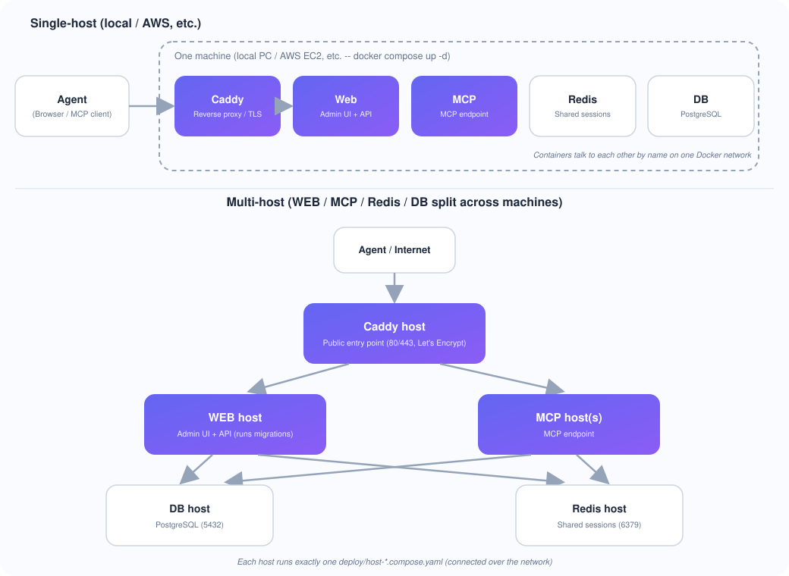

[日本語](../SCALING.md) | English

# Scaling & Container Layout

AccelMCP runs both single-host and multi-host deployments **from the same image**.
By splitting the roles (WEB admin UI / MCP endpoint) into separate containers and sharing
Streamable HTTP sessions through Redis, the MCP endpoint can be scaled horizontally on its own.

## Container Layout

| Service | Role | Notes |
| --- | --- | --- |
| `caddy` | Reverse proxy / TLS | Routes by path to `web` and `mcp` |
| `web` | Admin UI + REST API | Runs DB migrations on startup |
| `mcp` | MCP endpoint | Same image as `web`; does NOT run migrations |
| `redis` | Shared session store | Holds Streamable HTTP sessions |
| `db` | PostgreSQL | Application data |

`web` and `mcp` use the **same image and the same app** (all blueprints registered); Caddy routes
requests by path. This is what lets "all-in-one on one host" and "role-split across hosts" both run
from the same compose definition.

### Caddy routing

Routing is by **path**, regardless of hostname.

| Path | Routed to |
| --- | --- |
| `/mcp`, `/mcp/<subdomain>`, `/<identifier>/mcp`, `/admin/mcp`, `/tools/*` | `mcp` |
| Everything else (`/`, `/dashboard`, `/api/*`, `/assets/*`, etc.) | `web` |

Caddy accepts both `localhost` (or `ACCEL_MCP_DOMAIN`) and the local-development domain
`lvh.me` / `*.lvh.me`. `lvh.me` always resolves to `127.0.0.1`, so subdomain-based MCP
services (`<identifier>.lvh.me/mcp`) work out of the box with no extra configuration.

## 1. Single-host (local, AWS, etc.)



Like Dify, run all containers on one machine. **The steps are the same whether it's your local
PC or a cloud VM like an AWS EC2 instance** — the only difference is whether you use a real domain.

### Local development / testing

```bash
git clone https://github.com/t-ogawa-dev/AccelMCP.git
cd AccelMCP
cp .env.example .env
docker compose up -d
```

Access at `https://localhost/` (click through the self-signed certificate warning; see
[HTTPS](#https) below). No need to set `ACCEL_MCP_DOMAIN`.

### Production on a single host (real domain, e.g. AWS EC2 or your own server)

1. Provision a machine and install Docker + Docker Compose (on AWS: launch an EC2 instance and
   allow **ports 80 and 443 from `0.0.0.0/0`** in the security group, plus 22 for SSH)
2. Point your domain's DNS A record at that machine's public IP
3. Deploy the repo and create `.env`:

   ```bash
   git clone https://github.com/t-ogawa-dev/AccelMCP.git
   cd AccelMCP
   cp .env.example .env
   ```

   Edit `.env`:

   ```bash
   ACCEL_MCP_DOMAIN=mcp.example.com   # your domain
   FLASK_ENV=production
   SECRET_KEY=<a random string, e.g. from `openssl rand -hex 32`>
   ADMIN_USERNAME=<change from the default>
   ADMIN_PASSWORD=<change from the default>
   ```

4. Start with the production Caddyfile (Let's Encrypt):

   ```bash
   CADDYFILE=./Caddyfile.prod docker compose up -d --build
   ```

   (Or set `CADDYFILE=./Caddyfile.prod` in `.env` so plain `docker compose up -d` picks it up
   going forward.)

5. Visit `https://mcp.example.com/login` to confirm (Let's Encrypt issues a real certificate
   automatically, so there's no browser warning).

- `web` / `mcp` / `redis` / `db` / `caddy` all run on the same machine.
- Because Redis is present, Streamable HTTP sessions are stored in Redis, but a single host can
  also run with in-memory sessions (see below).
- To split across multiple machines instead, see
  [4. Spreading across multiple hosts](#4-spreading-across-multiple-hosts).

## HTTPS

Port 5000 on the `web`/`mcp` containers is **not published to the host** (`expose` only).
Always access through Caddy from your browser or MCP client.

| Purpose | URL |
| --- | --- |
| Web admin UI | `https://localhost/` |
| MCP service (subdomain-based) | `https://<identifier>.lvh.me/mcp` |
| MCP service (path-based) | `https://localhost/<identifier>/mcp` |

No port number is needed (Caddy listens on 443 and proxies internally to port 5000).

### "Your connection is not private" / certificate warning

This is expected. The local-dev `Caddyfile` uses `tls internal`, which issues certificates
from **Caddy's own self-signed CA** (Let's Encrypt cannot be used for local development,
since `localhost`/`lvh.me` are not real public domains). Two options:

**A. Click through the browser warning (simplest)**

Choose "Advanced" → "Proceed to localhost (unsafe)" (or equivalent) on the warning page.

**B. Trust Caddy's local CA in your OS (to remove the warning)**

```bash
docker cp mcp_caddy:/data/caddy/pki/authorities/local/root.crt ./caddy_local_ca.crt
```

Then import `caddy_local_ca.crt` into your OS trust store — on macOS, drag it into Keychain
Access and set it to "Always Trust"; on Windows, import it into "Trusted Root Certification
Authorities".

### Running directly with `python run.py` (no Docker)

The Flask dev server binds directly to port 5000, so access it without TLS
(`http://localhost:5000/`, `http://<identifier>.lvh.me:5000/mcp`).

## 2. About the session store (Redis)

Streamable HTTP validates the `Mcp-Session-Id` issued at `initialize` on subsequent requests.
When the MCP endpoint runs as **multiple replicas / multiple hosts**, a follow-up request routed to
a different replica can no longer recognize the session, so the session must live in a shared store.

- When `REDIS_URL` is **set**: sessions are stored in Redis (shared).
  - Example: `REDIS_URL=redis://redis:6379/0`
  - Even with multiple `mcp` replicas, any replica can validate the session.
- When `REDIS_URL` is **unset**: sessions are stored in process memory.
  - No extra infrastructure required. This is sufficient for **single-host, single-process** runs.
  - Not usable with multiple replicas, since sessions are not shared between them.

`compose.yaml` passes `REDIS_URL=redis://redis:6379/0` by default. To run a single-instance setup
without Redis, leave `REDIS_URL` empty.

## 3. Scaling only the MCP endpoint

To add replicas on the same host:

```bash
docker compose up -d --scale mcp=3
```

(Caddy's `reverse_proxy mcp:5000` load-balances across replicas via Docker DNS round-robin. Because
sessions are shared through `REDIS_URL`, any replica that receives a follow-up request stays consistent.)

## 4. Spreading across multiple hosts

Run WEB / MCP / Redis / DB on separate machines. The `deploy/` directory provides **one
compose file per role**, so each machine only runs the file for its role.

| File | Role | Run on |
| --- | --- | --- |
| `deploy/host-db.compose.yaml` | PostgreSQL | DB host |
| `deploy/host-redis.compose.yaml` | Redis (shared sessions) | Redis host |
| `deploy/host-web.compose.yaml` | Admin UI + REST API (runs migrations) | WEB host |
| `deploy/host-mcp.compose.yaml` | MCP endpoint | MCP host(s) |
| `deploy/host-caddy.compose.yaml` | Reverse proxy / TLS (public entry point) | Caddy host |

### Network requirements (firewall / security group)

| Host | Open port | Allowed from |
| --- | --- | --- |
| DB host | 5432 | WEB host(s) and MCP host(s) only |
| Redis host | 6379 | WEB host(s) and MCP host(s) only |
| WEB host | 5000 | Caddy host only |
| MCP host | 5000 | Caddy host only |
| Caddy host | 80, 443 | The public internet (this is the entry point) |

### Steps

Install Docker + Docker Compose and deploy the repo on each machine, then run the following
(from the `deploy/` directory).

**1. On the DB host:**

```bash
cd deploy
docker compose -f host-db.compose.yaml up -d
```

**2. On the Redis host:**

```bash
cd deploy
docker compose -f host-redis.compose.yaml up -d
```

**3. Create a shared `.env` for the WEB host and every MCP host:**

```bash
# .env (repository root)
DATABASE_URL=postgresql://mcpuser:mcppassword@<db-host-address>:5432/mcpdb
REDIS_URL=redis://<redis-host-address>:6379/0
SECRET_KEY=<a random string>
ADMIN_USERNAME=<change from the default>
ADMIN_PASSWORD=<change from the default>
FLASK_ENV=production
```

**4. On the WEB host (this runs migrations):**

```bash
cd deploy
docker compose -f host-web.compose.yaml up -d --build
```

**5. On each MCP host (repeat on additional machines to add more MCP hosts):**

```bash
cd deploy
docker compose -f host-mcp.compose.yaml up -d --build
```

**6. On the Caddy host (point WEB_UPSTREAM/MCP_UPSTREAM at the other hosts):**

```bash
cd deploy
ACCEL_MCP_DOMAIN=mcp.example.com \
WEB_UPSTREAM=<web-host-address>:5000 \
MCP_UPSTREAM="<mcp-host-1-address>:5000 <mcp-host-2-address>:5000" \
CADDYFILE=../Caddyfile.prod \
docker compose -f host-caddy.compose.yaml up -d
```

`MCP_UPSTREAM` accepts multiple space-separated addresses (for multiple MCP hosts). For local
multi-host testing without a real domain, use `CADDYFILE=../Caddyfile` (self-signed certificate)
instead.

**7. Verify:** visit `https://mcp.example.com/login` (or `https://<caddy-host-address>/login`)
and confirm the admin UI loads.

### Key points

- `mcp` does NOT run migrations (`web` does). Schema updates happen once, during the WEB host
  deployment.
- The WEB host and every MCP host must reference the **same `REDIS_URL` and the same
  `DATABASE_URL`**.
- To add another MCP host, just run step 5 on the new machine and add its address to the
  Caddy host's `MCP_UPSTREAM`, then restart Caddy.
- The same steps are also documented as comments inside each `deploy/host-*.compose.yaml` file.

## Related implementation

- Session store abstraction: [app/services/session_store.py](https://github.com/t-ogawa-dev/AccelMCP/blob/main/app/services/session_store.py)
  - `InMemorySessionStore` / `RedisSessionStore` / `get_session_store(namespace)`
  - Sessions are isolated by namespace: `"mcp"` (the MCP endpoint) and `"admin"` (Admin MCP)
- Session usage:
  - [app/controllers/mcp_controller.py](https://github.com/t-ogawa-dev/AccelMCP/blob/main/app/controllers/mcp_controller.py)
  - [app/controllers/admin_mcp_controller.py](https://github.com/t-ogawa-dev/AccelMCP/blob/main/app/controllers/admin_mcp_controller.py)

## Tests

- `tests/unit/infrastructure/test_session_store.py` — unit tests for the session store
  (in-memory / Redis / backend selection)
- `tests/unit/mcp/test_relay_and_streamable.py::TestStreamableHttpRedisSession` —
  Streamable HTTP session round-trip on the Redis backend
- `tests/integration/test_streamable_chain.py` — multi-hop Streamable HTTP chaining with real servers
