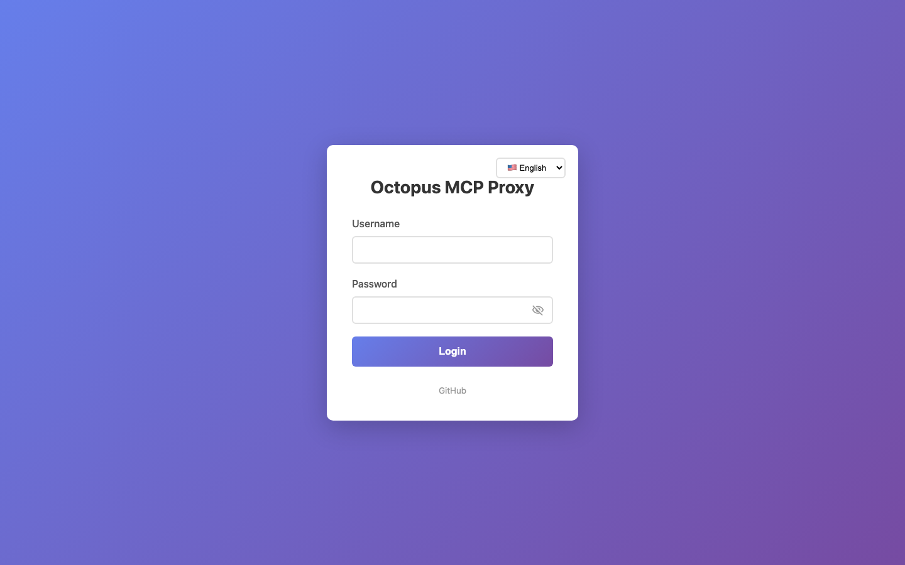
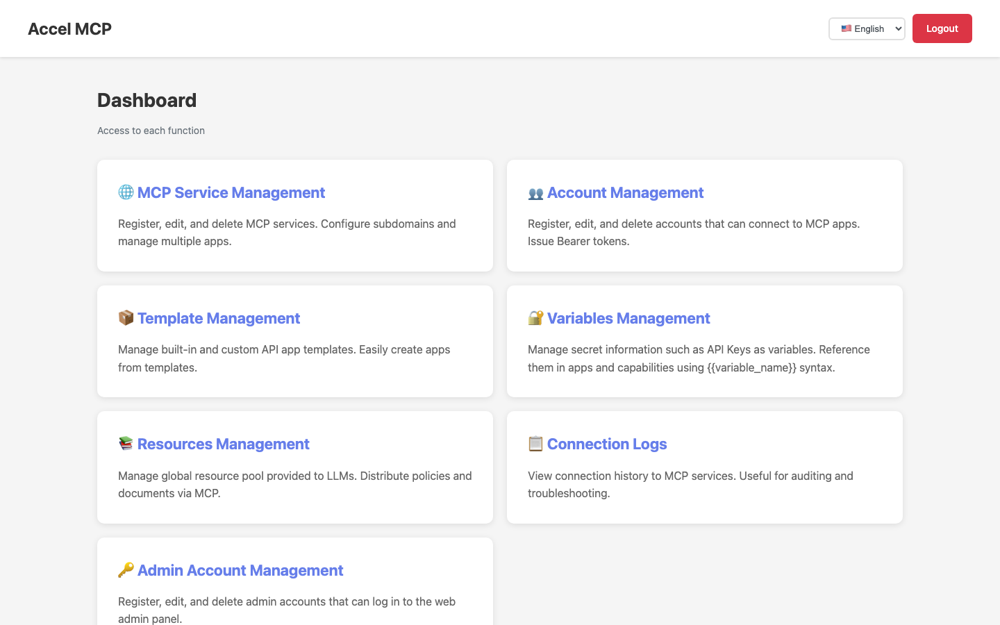
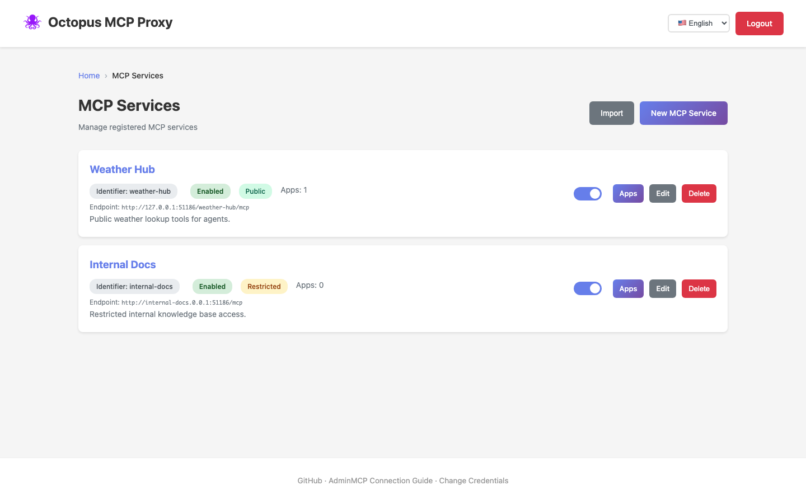
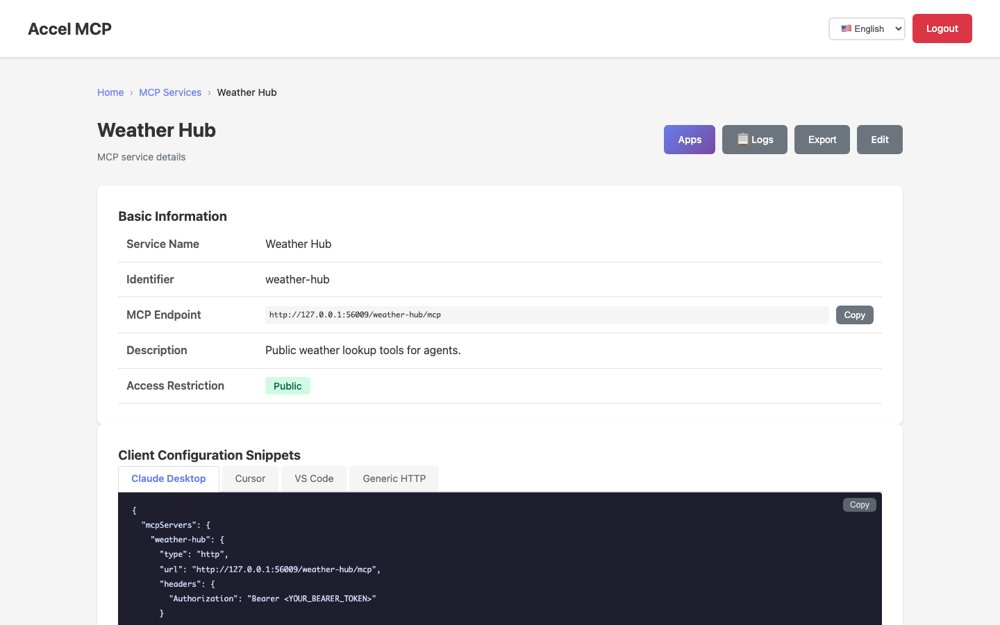
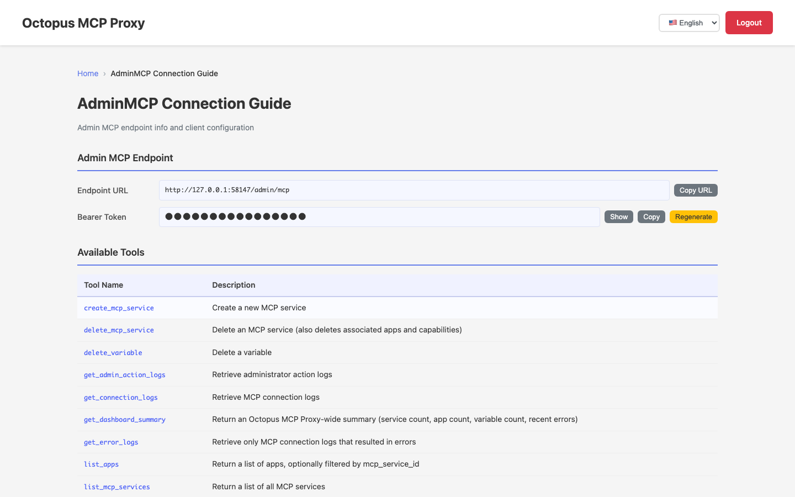
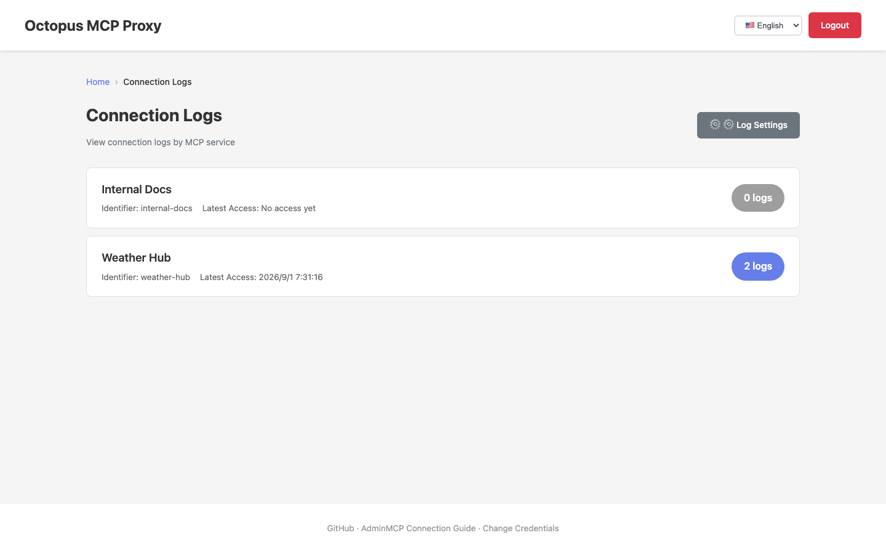
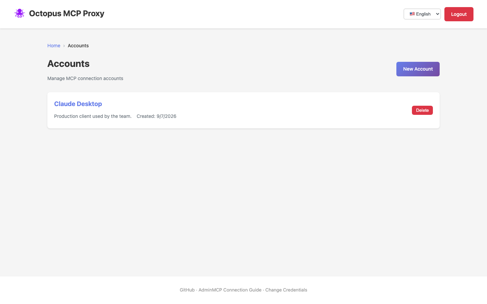

# Octopus MCP Proxy

HTTP/stdio compatible MCP server with API/MCP relay functionality and user-based permission
management via a Web admin interface.

[GitHub Repository](https://github.com/t-ogawa-dev/octopus-mcp-proxy){ .md-button .md-button--primary }
[日本語ドキュメント](../index.md){ .md-button }

## Key Features

- **MCP Protocol Support**: Compatible with both HTTP and stdio, including Streamable HTTP (SSE)
- **Relay Functionality**: Relay to API and MCP servers, including daisy-chaining multiple Octopus MCP Proxy instances
- **Permission Management**: User-specific Tool usage permission control (3-tier hierarchy)
- **Web Admin Interface**: Manage Services, Capabilities, Accounts, and admin users
- **Bearer Token Authentication**: Per-account token generation
- **Horizontal Scaling**: Split WEB / MCP containers and share sessions via Redis to scale out

## Screenshots

!!! note
Octopus MCP Proxy ships with a built-in language switcher (top-right corner). The
screenshots below show the English UI; a Japanese UI is also available.

_Login screen_

_Dashboard — entry point to every admin feature_

_MCP services list — shows public/restricted access control at a glance_

_MCP service detail — auto-generated client configuration snippets for Claude Desktop / Cursor / VS Code_

_AdminMCP connection guide — endpoint info and the list of available tools_

_Connection logs — review connection history per MCP service_

_Connection accounts list — issue Bearer tokens for MCP clients_

## Documentation

| Document                               | Description                                                         |
| -------------------------------------- | ------------------------------------------------------------------- |
| [Quick Start](QUICKSTART.en.md)        | Fastest way to start and test the MCP server in 5 minutes           |
| [Setup Guide](SETUP.en.md)             | Detailed setup and startup instructions                             |
| [MCP Endpoints](MCP_ENDPOINTS.en.md)   | Detailed usage of each MCP server endpoint                          |
| [Directory Structure](STRUCTURE.en.md) | Project structure based on MVC pattern                              |
| [Testing Guide](TESTING.en.md)         | How to run unit and integration tests                               |
| [E2E Testing](E2E_TESTING.en.md)       | How to run E2E tests with Playwright                                |
| [Database Migration](MIGRATION.en.md)  | Database migration management with Flask-Migrate (Alembic)          |
| [Scaling & Containers](SCALING.en.md)  | Container layout, single-host vs. multi-host, Redis-backed sessions |

## About This Project

This project was built **100% through vibe coding** — all code was implemented via pair
programming with AI.

**Models used:** Claude Sonnet 4.5 / 4.6, Claude Opus 4.8
