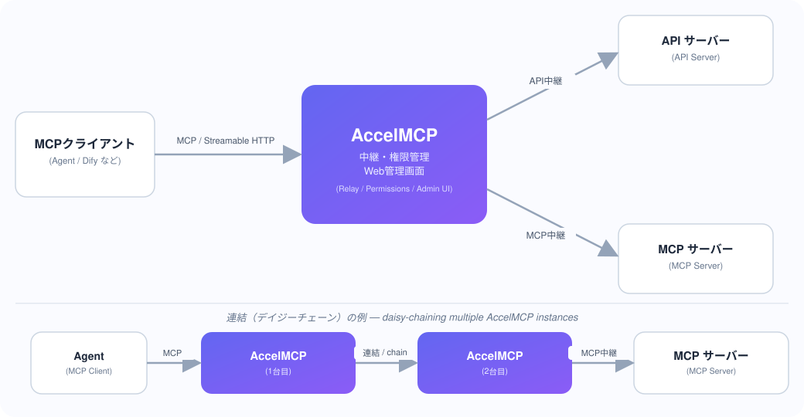
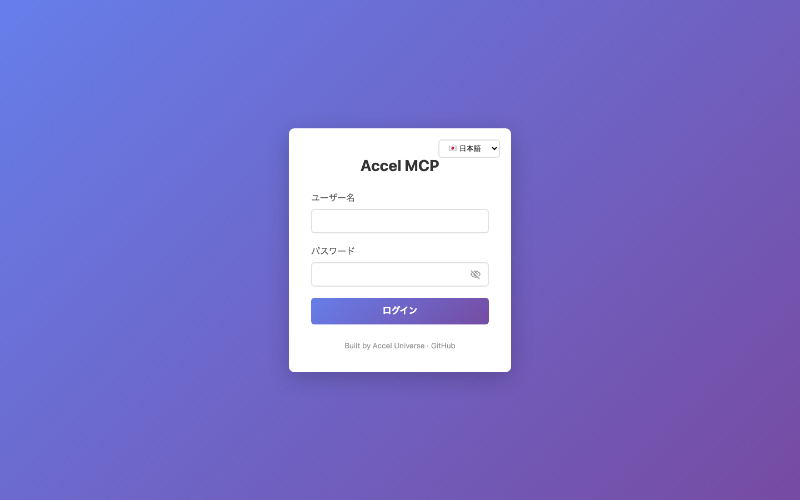
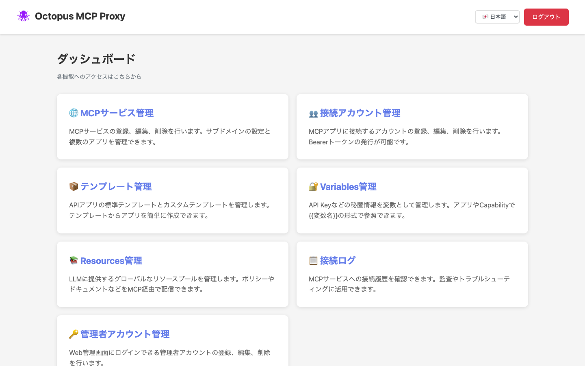
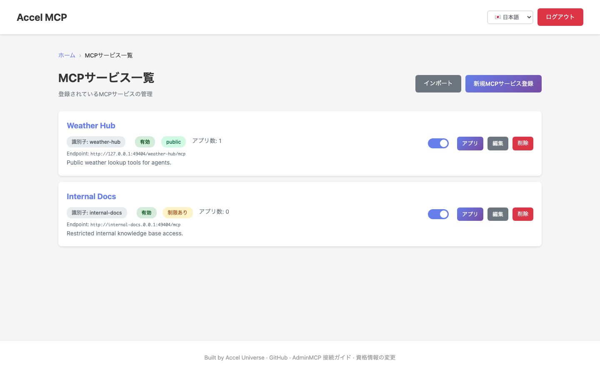
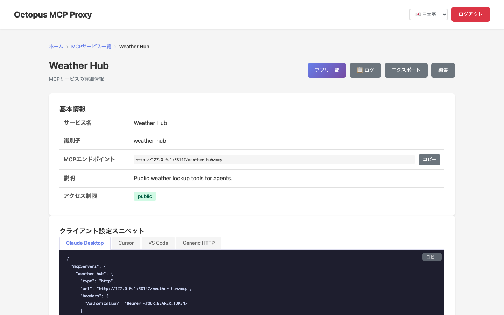
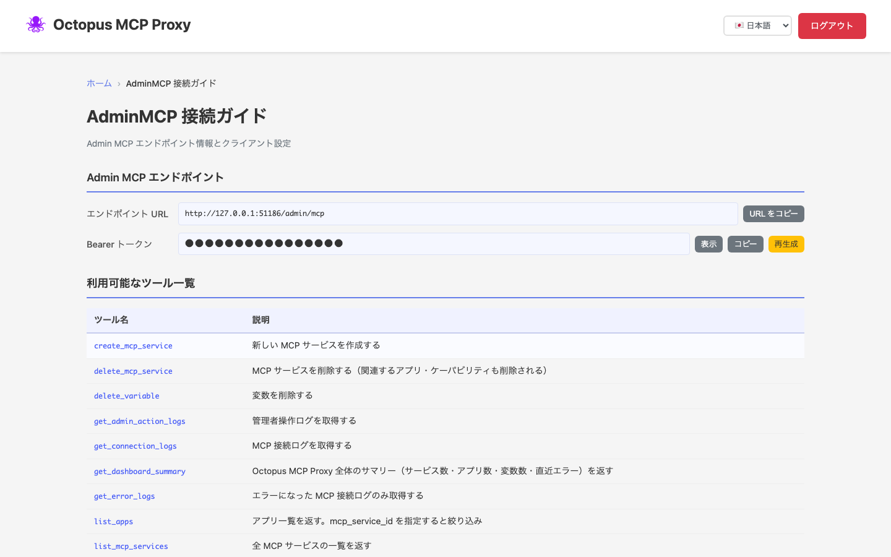
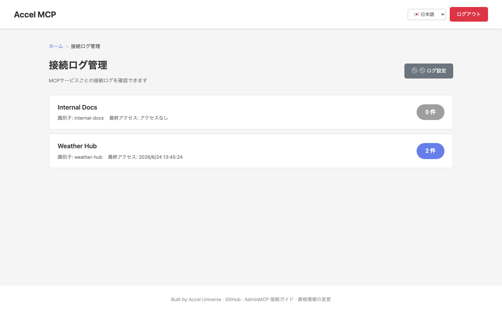
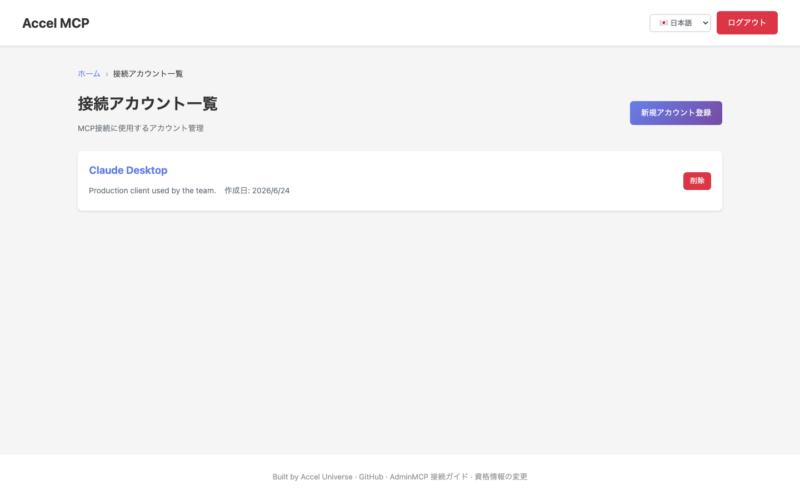

# AccelMCP

HTTP/stdio 対応の MCP サーバー。API/MCP 中継機能とユーザー別権限管理を備えた Web 管理画面付き。

[GitHub リポジトリ](https://github.com/t-ogawa-dev/AccelMCP){ .md-button .md-button--primary }
[English docs](en/index.en.md){ .md-button }

## 主な機能

- **MCP プロトコル対応**: HTTP と stdio の両方をサポート、Streamable HTTP (SSE) にも対応
- **中継機能**: API および MCP サーバーへの中継。AccelMCP 同士の連結(デイジーチェーン)も可能
- **権限管理**: ユーザーごとの Tool 使用権限制御(3階層)
- **Web 管理画面**: サービス、Capability、ユーザー、管理者アカウントの管理
- **Bearer トークン認証**: ユーザー別のトークン発行
- **水平スケール**: WEB / MCP コンテナを分離し、Redis でセッション共有してスケール可能

## スクリーンショット

*ログイン画面*

*ダッシュボード — 各管理機能への入口*

*MCPサービス一覧 — public/restrictedのアクセス制御を一覧表示*

*MCPサービス詳細 — Claude Desktop / Cursor / VS Code 向けのクライアント設定スニペットを自動生成*

*AdminMCP接続ガイド — エンドポイント情報と利用可能なツール一覧*

*接続ログ管理 — MCPサービスごとの接続履歴を確認*

*接続アカウント一覧 — Bearerトークンを発行してMCPクライアントに配布*

## ドキュメント一覧

| ドキュメント | 内容 |
| --- | --- |
| [クイックスタート](QUICKSTART.md) | 5分でMCPサーバーを起動・テストする最短手順 |
| [セットアップガイド](SETUP.md) | 詳細なセットアップ・起動手順 |
| [MCPエンドポイント詳細](MCP_ENDPOINTS.md) | 各MCPエンドポイントの詳細な使用方法 |
| [ディレクトリ構造](STRUCTURE.md) | MVCパターンに基づくプロジェクト構成 |
| [テストガイド](TESTING.md) | ユニットテスト・統合テストの実行方法 |
| [E2Eテスト](E2E_TESTING.md) | Playwrightを使ったE2Eテストの実行方法 |
| [データベースマイグレーション](MIGRATION.md) | Flask-Migrate (Alembic) を使ったマイグレーション管理 |
| [スケーリング・コンテナ構成](SCALING.md) | コンテナ構成、1台/複数台運用、Redisセッション共有 |

## このプロジェクトについて

このプロジェクトは **100% バイブコーディング(vibe coding)** で作成されています。
コードはすべて AI とのペアプログラミングによって実装されました。

**使用モデル:** Claude Sonnet 4.5 / 4.6、Claude Opus 4.8
